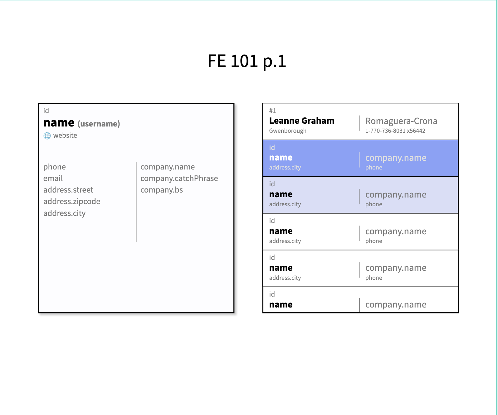

# FE - 101 

## part I

In this part we will summarize the things that we did so far. Assignment is simple: 

> Fetch the list of users, display them on rhe right side, and display the selected user details on the left side. By default, after entering the page and loading the data, the first user should be selected. We select the users by clicking on their tile on the list. Also we apply some styling on hovered user. List and the details containers should be the same size, so it means, that in case there is more users, list should be scrollable.

Feel free to use whatever library you'd like, you can use MUI, or bootstrap, whatever you prefer, you can also just use React's JSX with plain html elements. Also, don't spend too much time on the layout if it's too complicated. It's nice to practice some flexbox ( [here's everything you need to know](https://css-tricks.com/snippets/css/a-guide-to-flexbox/) ), but he're we mostly want to practice data fetching, and synchronising the data between parents and children components.

To have some real http request, we will use a free test api called `jsonplaceholder`. You can check what's more in there right here -> https://jsonplaceholder.typicode.com/. We will use more of the endpoints of it in the future.

The exact endpoint that you'll use for this part is:

```
https://jsonplaceholder.typicode.com/users
```

The desing for the UI is placed under [PENPOT link](https://design.penpot.app/#/workspace?team-id=6f5ef70f-2f09-81ea-8007-450e9b5b0e0a&file-id=87795101-e4ce-8012-8007-44e24722c9b3&page-id=87795101-e4ce-8012-8007-44e24722c9b4)

Basically what we want to achieve will look more or less like that:



And of course, in case of any questions, you know where to find me ;)

Good luck!